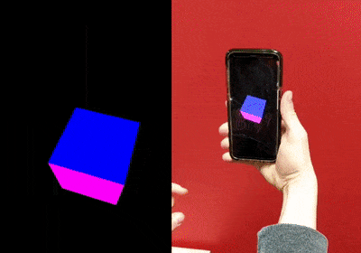

# NAVS

NAVS (NDK-Android-Vulkan-Senors) is a set of examples showing how to mix NDK Sensors with Vulkan Graphics

# Current setup tested with
- Android Studio 3.1.1 and up
- Android API 26 (8.0 Oreo)
- Build Tools 27.0.3

# How To Run

To save space, I bundled libraries such as [assimp](https://github.com/assimp/assimp), [glm](https://github.com/g-truc/glm), [gli](https://github.com/g-truc/gli), etc. together in [external directory](./external). Some are submodules and will have to clone those in.

```
git clone https://github.com/sjfricke/NDK-Android-Vulkan-Senors.git
cd NDK-Android-Vulkan-Senors
git submodule init
git submodule update
```

This will clone in the external libraries you will need. From here all apps are self contain for the rest of code needed to run. Simply open any of the folders in Android Studio, build and run. Leave an [issue](https://github.com/sjfricke/NDK-Android-Vulkan-Senors/issues) if something doesn't build or work correctly.

# Current Examples

## [Accelerometer-Cube](./Accelerometer-Cube)

This demo shows how to mix Vulkan with the NDK accelerometer sensor to make for some very primative AR/VR style movement with high performance graphics



## [Heart-Beat-Animation](./Heart-Beat-Animation)

This demo shows how to utalize the heartbeat sensor on the device. It loads in a [heart model by DarkLoardFlash](https://sketchfab.com/models/2fbba4bce48b47d89eac0f525d59ed2e#) with assimp and the textures with gli. There are 5 different layers of texutres to help give a more realistic look.

- CURRENT WORK IN PROGRESS
